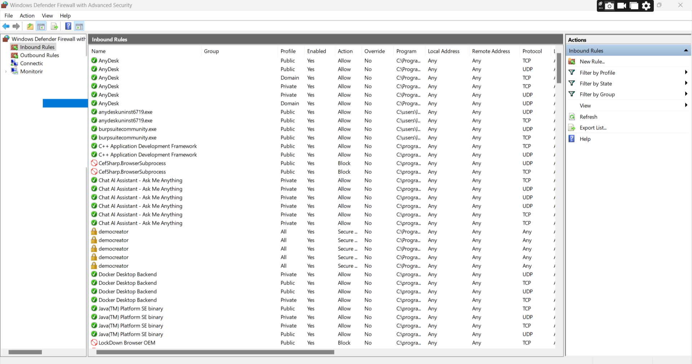
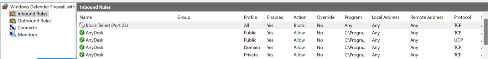
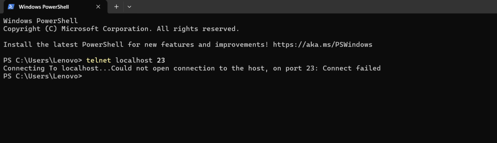
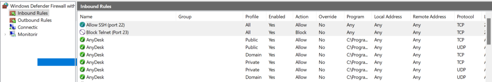
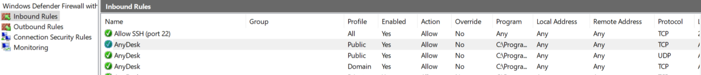

Cybersecurity Internship: Task 4 Setup and Use a Firewall on Windows/Linux

# 🔒 Windows Firewall Configuration Task

## 🎯 Objective

Configure and test basic firewall rules to allow or block traffic using **Windows Firewall**.

---

## 🛠 Tools Used

- Windows Defender Firewall with Advanced Security (`wf.msc`)
- Command Prompt
- Telnet Client (for testing)

---

## ✅ Steps Performed

### 1. Opened Windows Firewall

- Used `wf.msc` to open the Windows Firewall GUI.

### 2. Listed Current Inbound Rules

- Viewed and captured existing rules under **Inbound Rules**.

📸 Screenshot:  

---

### 3. Blocked Inbound Traffic on Port 23 (Telnet)

- Created a new inbound rule to **block TCP port 23**.
- Selected: Block the connection → All profiles → Named it `Block Telnet (Port 23)`.

📸 Screenshot:  

---

### 4. Tested the Block Rule

- Tried connecting via: telnet localhost 23
- Connection failed (blocked as expected).

📸 Screenshot:  

---

### 5. Allowed SSH Port (22)

- Created a rule to allow TCP port 22 (used in SSH on Linux).
- Named it `Allow SSH (Port 22)`.

📸 Screenshot:  

---

### 6. Removed the Block Rule

- Deleted the `Block Telnet (Port 23)` rule to restore original settings.

📸 Screenshot:  

---

## 📜 Summary: How Windows Firewall Filters Traffic

Windows Firewall filters **network traffic** using inbound and outbound rules. Each rule specifies:

- Protocol (TCP/UDP)
- Port number
- Action (Allow or Block)
- Profile (Domain, Private, Public)

When a rule blocks a port (like TCP 23), traffic to that port is **dropped silently**. This enhances system security by preventing unauthorized access.

---

## 📂 Files Included

- `screenshots/` – All screenshots taken during the task
- `commands-used.txt` – Step-by-step commands and actions
- `README.md` – This report

---

## 📅 Task Outcome

- ✔️ Understood and applied Windows firewall rules
- ✔️ Demonstrated ability to block and allow traffic
- ✔️ Documented all actions clearly

---

